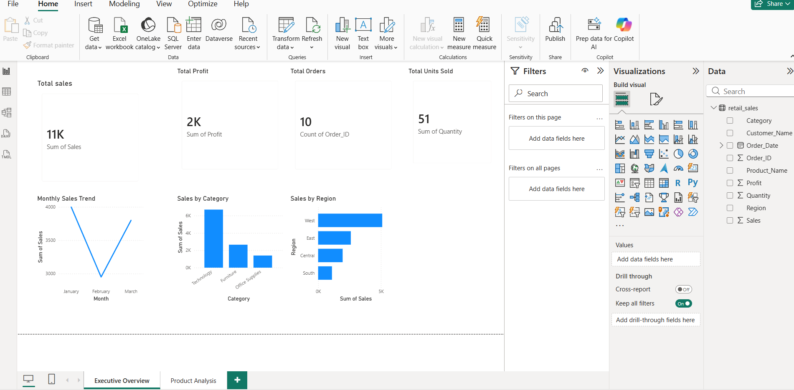
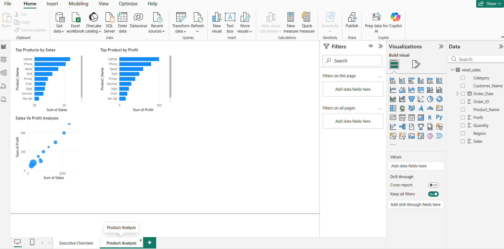

# Retail Sales Analytics Dashboard

## Project Overview

This project analyzes retail sales data to understand business performance, identify top-performing products, and provide business insights through an interactive Power BI dashboard.

The goal of this project is to help management answer important business questions:

* How is the business performing overall?
* Which products generate the most revenue?
* Which products generate the highest profit?
* Which regions contribute the most sales?

---

## Tools & Technologies Used

* Power BI Desktop
* Power Query
* DAX
* Data Modeling
* Microsoft Excel / CSV
* SQL
* GitHub

---

# Dashboard Pages

## 1. Executive Overview

This page provides a high-level summary of business performance.

### Key Metrics

* Total Sales
* Total Profit
* Total Orders
* Total Units Sold

### Visualizations

* Monthly Sales Trend
* Sales by Category
* Sales by Region

### Screenshot

---

## 2. Product Analysis

This page focuses on product performance.

### Analysis Includes

* Top Products by Sales
* Top Products by Profit
* Sales vs Profit Relationship

### Screenshot

---

# Key Business Insights

* Identified products generating the highest revenue.
* Compared sales performance against profitability.
* Analyzed regional sales contribution.
* Tracked monthly sales trends.
* Identified relationships between sales volume and profitability.

---

# Skills Demonstrated

* Data Cleaning
* Data Transformation
* Data Modeling
* Data Visualization
* Business Intelligence Reporting
* Dashboard Development
* Data Analysis
* SQL Analysis

---

# Project Files

* **Retail_Sales_Dashboard.pbix** → Power BI dashboard file
* **retail_sales.csv** → Raw retail sales dataset
* **SQL/retail_database.sql** → SQL database and analysis queries
* **Images/** → Dashboard screenshots

---

## Project Status

Completed ✅

This project demonstrates an end-to-end data analytics workflow from raw data preparation to business intelligence reporting.

